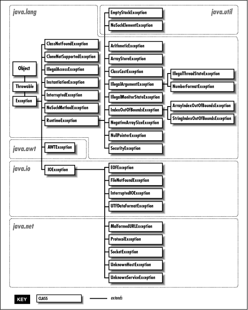

## Excepciones

## Java Framework Collection

### Indice

#### [1. Definición de error y excepcion](https://github.com/patoba/Curso-Java/blob/master/Java%20Intermedio/Excepciones/README.md#1-definicion-de-error-y-excepción)

#### [2. Clase Exception](https://github.com/patoba/Curso-Java/blob/master/Java%20Intermedio/Excepciones/README.md#2-clase-exception-1)

>* Excepciones basicas
>* Palabras reservadas try, catch y finally

#### [3. Clase Throwable](https://github.com/patoba/Curso-Java/blob/master/Java%20Intermedio/Excepciones/README.md#3-clase-throwable-1) 
>*  Palabras reservadas throw y throws

#### [4. Creacion de excepciones propias](https://github.com/patoba/Curso-Java/blob/master/Java%20Intermedio/Excepciones/README.md#4-creación-de-excepciones-propias)

### Retornos
1. [Curso Java](https://github.com/patoba/Curso-Java 'Curso Java')
2. [Java Intermedio](https://github.com/patoba/Curso-Java/tree/master/Java%20Intermedio 'Java Intermedio')
- - - -

### 1. Definicion de error y excepción
#### 1.1 Introducción
En la documentación de Java se define excepción cómo *Un evento, el cual ocurre durante la ejecución de un programa, que interrumpe el flujo normal de las instrucciones del programa.* . 

Cuando un error ocurre dentro de un método, el método crea un objeto llamado excepción. El objeto excepción contiene información del error, incluyendo el tipo de error y el estado del programa cuando el error ocurrió. Después de ue un metodo arroja una excepción Java intenta encontrar un manejador de excepcion, a este proceso se le llama *call stack*.

Se dice que el sistema cacha la excepción si después de realizar una busqueda exhaustiva, no encuentra una manejador de excepción adecuado.

#### 1.2 Definiciones
Exception y error son clases hijas de la clase Throwable. Un objeto Throwable contiene la información del hilo en el momento que fue creado.

Tanto exception como error son utilizadas para representar excepciones, situaciones que interrumpen el flujo del programa, pero son usadas para tratar excepciones distintas.

* **Error** : Situaciones que no pueden ser manejables. Por ejemplo: poca memoria RAM, error en el disco duro. 
* **Exception** : Situaciones que pueden ser manejables.  

Las excepciones más comunes están contenidas en dos clases hijas de Exception, IOException y RuntimeException. También llamadas comprobadas o no comprobadas. 

* **Comprobadas** : Situaciones provocadas por el programador. Ejemplo : Errores lógicos. 
* **No Comprobadas** : Situaciones aparte del código del programa. Ejemplo: Ausencia de un archivo o un input mal puesto.

### 2. Clase Exception
#### 2.1 Introducción
La clase Exception es la clase padre de todos las Excepciones manejables. Algunos de los metodos más importante de Exception s emuestran a continuación.

| Dato de Retorno | Cabecera                         | Descripción                                                                                                                    |
|-----------------|----------------------------------|-------------------------------------------------------------------------------------------------------------------------------|
| void            | addSuppresed(Throwable objeto)   | Describe la excepción exacta que se arrojó                                                                                    |
| void            | getMessage()                     | Retorna el mensaje de los detalles de este objeto Throwable                                                                    |
| Throwable       | getCause()                       | Retorna la causa por la cual el throwable fue arrojado (La causa es el throwable que causo que este throwable fuera arrojado) |
| void            | printStackTrace()                | Imprime la ruta de donde surgio la excepción.                                                                                  |

En el tema anterior, vimos que las situaciones de la clase Exception son las manejables y que se dividen en 2 tipos. Existe una gran variedad de excepciones, podemos verlas en la imagen siguiente. 

#### 2.2 Excepciones Básicas 
En la imagen anterior observamos una gran mayoria de las excepciones en Java. A continuación definiremos unas cuantas de ellas.

| Excepción                       | Descripción                                                                               | Ejemplo                            |
|---------------------------------|-------------------------------------------------------------------------------------------|------------------------------------|
| Arithmetic Exception            | Es arrojada cuando ocurre una excepción una operación aritmética.                         | División entre cero.                |
| ArrayIndexOutOfBoundException   | Es arrojada cuando se acceso a un indice ilegal de un arreglo.                            | Arreglo[-3]                       | 
| ClassNotFoundException          | Es arrojada cuando se intenta acceder a una clase que no esta definida.                   | Class a = new ClaseNoExistente()   |
| FileNotFoundException           | Esta excepción se genera cuando un archivo no es accesible o no se abre.                  |
                           |
| IOException                     | Se lanza cuando una operación de input/output falla o se interrumpe.                      |
                           |
| InterruptedException            | Se lanza cuando un hilo está esperando, durmiendo o procesando, y se interrumpe.          |
                           |
| NoSuchMethodException           | Se lanza cuando se accede a un método que no se encuentra.                                |
                           |
| NullPointerException            | Es arrojada cuando se hace referencia a los miembros de un objeto nulo.                   |
                           |
| Exception                       | Es arrojada cuando una excepción ocurre                                                   |
                           |
| StringIndexOutOfBoundsException | Arrojado por la clase String cuando un índice es negativo o mayor al tamaño de la cadena. |
                           |
| RuntimeException                | Esto representa cualquier excepción que se produce durante el tiempo de ejecución.        |  
                           |
                           
#### 2.3 Palabras reservadas try, catch y finally

### 3. Clase Throwable 
#### 3.1 Introducción 
Para evitar que exista una excepción , primero se tiene que arrojar desde alguna parte del código. Cualquier bloque de código puede arrojar excepciones. Pero existe una manera de definir en que momento en se va a arrojar una excepción en particular.

#### 3.2 Palabras reservadas throw y throws 

### 4. Creación de excepciones propias

